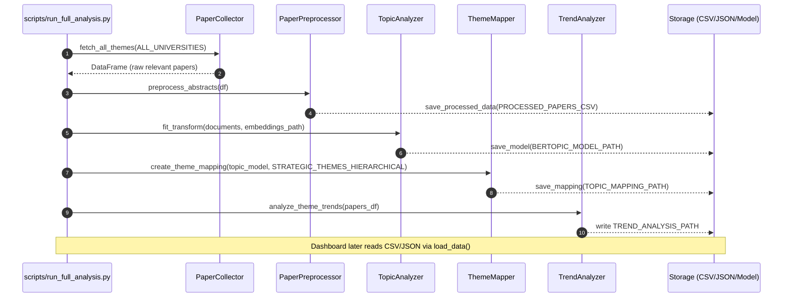

# UML Diagrams for Smarter Research Insights

This document provides high-level UML diagrams of the core pipeline and how artifacts flow through the system. All naming reflects the neutral, de-branded identifiers (e.g., STRATEGIC_THEMES, TopicAnalyzer).

## Class diagram

```mermaid
classDiagram
    direction LR

    class Settings <<config>> {
      +OPENALEX_EMAIL
      +ANALYSIS_START_DATE
      +ANALYSIS_END_DATE
      +ALL_UNIVERSITIES
      +PROCESSED_PAPERS_CSV
      +TOPIC_MAPPING_PATH
      +TREND_ANALYSIS_PATH
      +BERTOPIC_MODEL_PATH
    }

    class Themes <<config>> {
      +STRATEGIC_THEMES
      +STRATEGIC_THEMES_HIERARCHICAL
    }

    class PaperCollector {
      +PaperCollector(email, start_date, end_date)
      +fetch_all_themes(universities, max_per_theme, priority_only, min_relevance) DataFrame
      +fetch_papers_for_theme(theme_name, universities, max_papers, per_page) DataFrame
      +filter_by_relevance(df, min_score) DataFrame
      +deduplicate_papers(df) DataFrame
      +save_to_csv(df, filepath) void
      +build_theme_query(theme_name, top_n_keywords) str
      -_parse_work(work, theme_name) dict
      -_reconstruct_abstract(inverted_index) str
    }

    class PaperPreprocessor {
      +PaperPreprocessor(min_abstract_length)
      +preprocess_abstracts(df) DataFrame
      +extract_keywords(df, top_n) Dict
      +get_processing_stats(df) Dict
      +save_processed_data(df, filepath) void
      -clean_text(text) str
      -tokenize_and_lemmatize(text) List~str~
    }

    class TopicAnalyzer {
      +TopicAnalyzer(min_topic_size, nr_topics)
      +create_bertopic_model() BERTopic
      +fit_transform(documents, embeddings_path) (List~int~, Array)
      +get_topics_over_time(documents, timestamps, topics, nr_bins) DataFrame
      +get_topic_info() DataFrame
      +get_representative_docs(topic_id, n_docs) List~str~
      +save_model(filepath) void
      +load_model(filepath) void
      +get_topic_keywords(topic_id, n_words) List~str~
      -topic_model BERTopic
    }

    class ThemeMapper {
      +ThemeMapper(strategic_themes, min_similarity, theme_thresholds)
      +create_theme_mapping(topic_model, hierarchical_themes) Dict
      +identify_cross_theme_topics(threshold) List~Dict~
      +save_mapping(filepath) void
      +load_mapping(filepath) void
      -calculate_keyword_similarity(topic_keywords, theme_keywords) float
      -map_topic_to_theme(topic_id, topic_keywords) (str, float, Dict)
      -map_topic_to_sub_theme(topic_keywords, parent_theme, hierarchical_themes) (str, float)
      -_vectorizer TfidfVectorizer
    }

    class TrendAnalyzer {
      +TrendAnalyzer(topic_theme_mapping, strategic_themes)
      +analyze_theme_trends(papers_df, topics_over_time) Dict
      +identify_emerging_topics(papers_df, threshold, recent_quarters) List~Dict~
      +rank_universities_by_theme(papers_df, theme) DataFrame
      +calculate_strategic_priority(theme_trends) List~Dict~
      -calculate_growth_rate(counts) float
    }

    class EmergingTopicsDetector {
      +EmergingTopicsDetector(bertopic_model_path, papers_df, topic_mapping, openai_api_key)
      +identify_emerging_topics(min_emergingness, top_n) DataFrame
      +generate_labels_for_emerging_topics(emerging_df, use_gpt) DataFrame
      +save_emerging_topics(emerging_df, filepath) void
      -calculate_emergingness_score(topic_id, recency_weight, growth_weight, volume_weight) Dict
      -generate_topic_label_with_gpt(keywords, theme, sub_theme, paper_count, growth_rate) str
      -_filter_noisy_keywords(keywords) List~str~
    }

    class DataLoader <<module>> {
      +load_data() (DataFrame, Dict, Dict)
    }

    %% Relationships
    Settings --> PaperCollector : provides dates, email, universities
    Settings --> DataLoader : provides file paths
    Themes --> PaperCollector : STRATEGIC_THEMES
    Themes --> ThemeMapper : STRATEGIC_THEMES(_HIERARCHICAL)

    PaperCollector --> PaperPreprocessor : raw papers (CSV/DataFrame)
    PaperPreprocessor --> TopicAnalyzer : documents/timestamps
    TopicAnalyzer --> ThemeMapper : topic_model
    ThemeMapper --> TrendAnalyzer : topic_theme_mapping

    %% Dashboard reads saved artifacts
    PaperPreprocessor ..> DataLoader : writes PROCESSED_PAPERS_CSV
    ThemeMapper ..> DataLoader : writes TOPIC_MAPPING_PATH
    TrendAnalyzer ..> DataLoader : writes TREND_ANALYSIS_PATH

    %% Detector dependencies
    EmergingTopicsDetector ..> TopicAnalyzer : loads model
    EmergingTopicsDetector ..> ThemeMapper : uses topic_mapping
    EmergingTopicsDetector ..> PaperPreprocessor : uses papers_df
```

## Sequence diagram (pipeline run)

## Notes
- Diagrams reflect current identifiers (STRATEGIC_THEMES, TopicAnalyzer, TrendAnalyzer, etc.).
- The dashboard (`dashboard/app.py`) uses `load_data()` to consume the artifacts produced by the pipeline: `PROCESSED_PAPERS_CSV`, `TOPIC_MAPPING_PATH`, and `TREND_ANALYSIS_PATH`.
- The `EmergingTopicsDetector` is optional and uses the BERTopic model, processed papers, and the saved topic mapping to compute emerging topics and generate labels (optionally via OpenAI).
